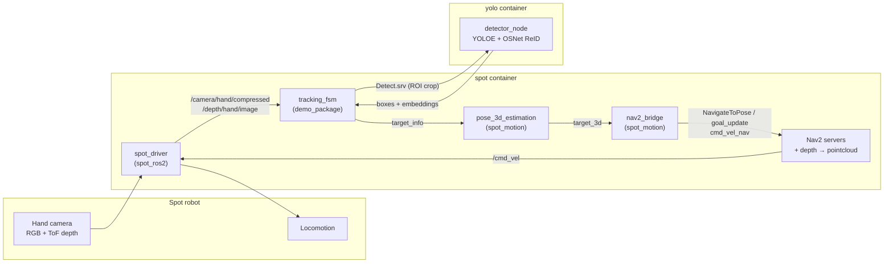

# Spot-Spark

Docker images, ROS 2 packages and configuration for running **Boston Dynamics Spot** demos on an **NVIDIA DGX Spark** (ARM64 / `aarch64`, CUDA).

The main application is a **person / robot following demo**:

1. Spot's **arm (hand) camera** streams RGB + ToF depth.
2. An open-vocabulary detector (**YOLOE**) finds people, quadrupeds and humanoid robots inside a region of interest.
3. A **tracking state machine** locks onto a single target and re-identifies it over time with a neural ReID embedding (**OSNet**) or BoT-SORT + HSV histograms.
4. The target is projected to 3D and sent to **Nav2** (or straight to the Spot SDK), so Spot walks toward the target, stops at a set distance and keeps it centred in view.

Everything runs inside Docker containers on the Spark, connected to Spot over the network.

---

## Documentation

| Section | What you will find |
|---|---|
| [Installation](docs/installation.md) | Host prerequisites, building the Docker images, model weights, building the ROS 2 workspace |
| [Running the application](docs/running.md) | Step-by-step launch of the full following pipeline on the real robot |
| [Architecture](docs/architecture.md) | Nodes, topics, data flow, the tracking state machine, the two motion back-ends |
| [ROS 2 interfaces](docs/interfaces.md) | Custom messages and services (`demo_interfaces`, `detector_interfaces`) |
| [Configuration](docs/configuration.md) | Every tunable: ROS parameters, in-code constants, Nav2 and tracker YAML files |
| [Testing with rosbags](docs/rosbag_testing.md) | Recording and replaying data to develop without the robot |
| [Troubleshooting](docs/troubleshooting.md) | Known issues, common errors, useful commands, Docker housekeeping |

Short reference sheets for each Docker image are also available: [ros2](docs/ros2_docker.md), [nav2](docs/nav2_docker.md), [gazebo](docs/gazebo_docker.md), [spot](docs/spot_docker.md), [yolo](docs/yolo_docker.md).

---

## Architecture at a glance



All containers use `--net=host`, so the nodes in the two containers discover each other through DDS as long as they share the same `ROS_DOMAIN_ID`.

---

## Quick start

```bash
# 1. Build the images (once) — see docs/installation.md
cd docker
docker build -t ros2      . -f ros2_humble.dockerfile
docker build -t nav2      . -f nav2.dockerfile
docker build -t gazebo    . -f gazebo.dockerfile
docker build -t spot      . -f spot.dockerfile
docker build -t spot-yolo . -f yolo.dockerfile

# 2. Start the containers, build the workspaces and launch the nodes
#    — see docs/running.md for the exact commands per terminal
```

---

## Repository layout

```text
Spot-Spark/
├── docker/                       # Dockerfiles (layered image chain) + helper files
│   ├── ros2_humble.dockerfile    # CUDA 12.4 + ROS 2 Humble desktop           → image "ros2"
│   ├── nav2.dockerfile           # + Navigation2                              → image "nav2"
│   ├── gazebo.dockerfile         # + Ignition Fortress, ros_gz                → image "gazebo"
│   ├── spot.dockerfile           # + Spot SDK 5.0.1, spot_ros2 driver         → image "spot"
│   ├── yolo.dockerfile           # ros2 + PyTorch, Ultralytics, torchreid     → image "spot-yolo"
│   ├── spot_entrypoint.sh
│   └── src/spot_launch_helpers.py  # patched file copied into spot_ros2
├── docs/                         # Documentation (this README links here)
└── src/trackerApp/               # ROS 2 source, mounted into the containers
    ├── demo_interfaces/          # msgs: TargetInfoMessage, TargetPose3D
    ├── spot/
    │   ├── config_spot/spot.yaml # spot_driver configuration
    │   └── demo_package/         # tracking_fsm node + geometry/ReID helpers
    ├── spot_motion/              # 3D pose, Nav2 bridge, SDK motion, launch files, Nav2 params, BT
    ├── yolo/
    │   ├── detector_interfaces/  # BoxDetection.msg, Detect.srv
    │   └── detector_package/     # detector_node (YOLOE + ReID), tracker YAMLs
    ├── color.py                  # list_spot_led_behaviors: lists LED behaviours on the robot
    ├── spot_nav_2.rviz           # RViz layout for following + Nav2
    ├── Comandi.txt               # scratch list of useful commands (Italian)
    └── frames_*.gv / *.pdf       # TF tree snapshots of the real robot
```

---

## Security notice

The Spot login credentials are currently **hard-coded** in `src/trackerApp/spot/config_spot/spot.yaml`, `demo_package/tracking_fsm.py` and `spot_motion/spot_motion.py`, and are part of the git history. Before sharing the repository, change the robot password and move the credentials to environment variables (`BOSDYN_CLIENT_USERNAME` / `BOSDYN_CLIENT_PASSWORD`). See [Configuration → Robot connection](docs/configuration.md#robot-connection).
