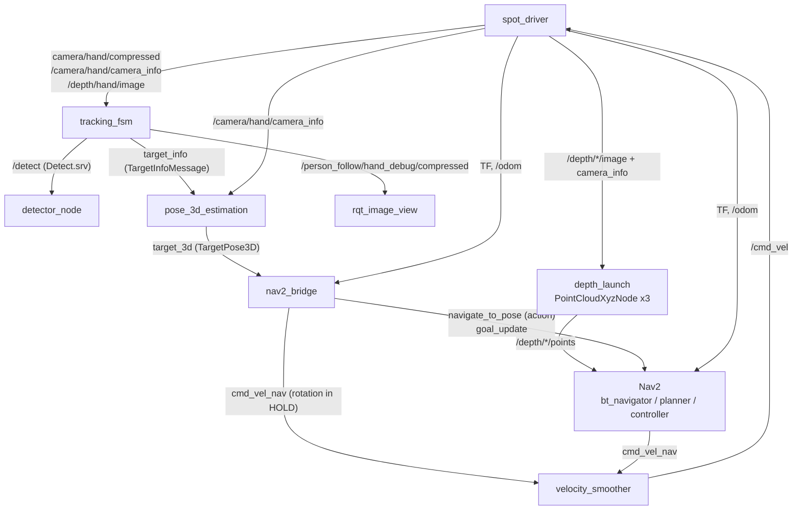
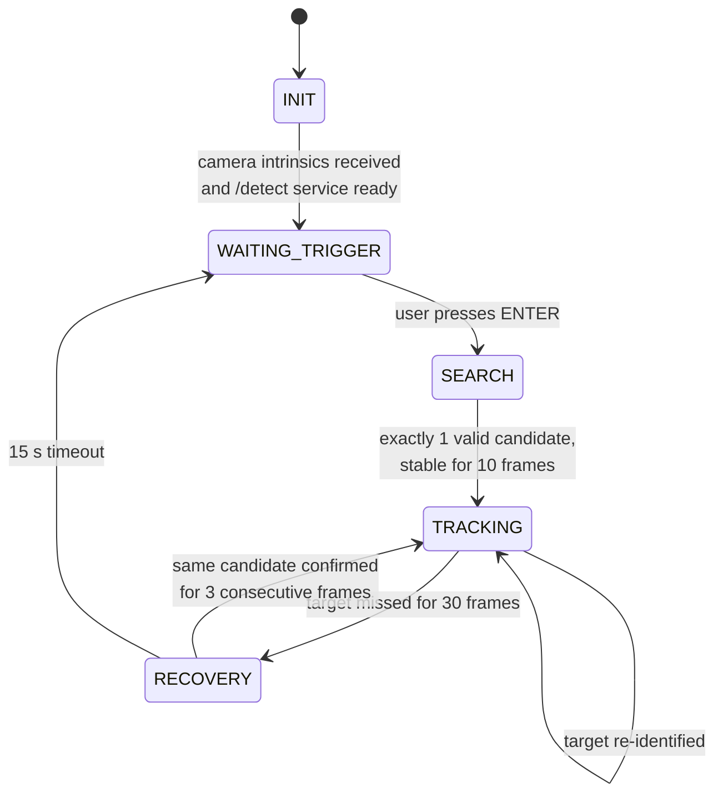

# Architecture

[← Back to README](../README.md)

- [Deployment view](#deployment-view)
- [ROS 2 packages](#ros-2-packages)
- [Data flow and topics](#data-flow-and-topics)
- [Perception](#perception)
- [Tracking state machine](#tracking-state-machine)
- [Re-identification strategies](#re-identification-strategies)
- [From 2D box to 3D target](#from-2d-box-to-3d-target)
- [Motion back-ends](#motion-back-ends)
- [Threading model](#threading-model)

---

## Deployment view

```text
┌───────────────────────── NVIDIA DGX Spark (host, --net=host) ─────────────────────────┐
│                                                                                        │
│  ┌────────────── spot container ──────────────┐   ┌──────── yolo container ────────┐   │
│  │ spot_driver (spot_ros2)                    │   │ detector_node                  │   │
│  │ tracking_fsm            ── Detect.srv ─────┼──►│   YOLOE (open vocabulary)      │   │
│  │ pose_3d_estimation                         │◄──┼── OSNet ReID embeddings        │   │
│  │ nav2_bridge / spot_motion                  │   │   (optional) BoT-SORT/OC-SORT  │   │
│  │ Nav2 servers + depth_image_proc            │   └────────────────────────────────┘   │
│  └──────────────────────┬─────────────────────┘                                        │
└─────────────────────────┼──────────────────────────────────────────────────────────────┘
                          │ gRPC (Spot SDK) over Wi-Fi / Ethernet
                    ┌─────▼─────┐
                    │   Spot    │  hand RGB + ToF depth, front depth cameras, locomotion, LEDs
                    └───────────┘
```

The GPU-heavy perception is isolated in its own image (`spot-yolo`), so the PyTorch/numpy dependencies do not clash with the Spot driver's Python environment. The two containers only talk over ROS 2 (one synchronous service).

---

## ROS 2 packages

| Package | Type | Container | Contents |
|---|---|---|---|
| `demo_interfaces` | ament_cmake | spot | `TargetInfoMessage.msg`, `TargetPose3D.msg` |
| `detector_interfaces` | ament_cmake | both | `BoxDetection.msg`, `Detect.srv` |
| `detector_package` | ament_python | yolo | `detector_node`, `YoloEInference` (ROS-free wrapper), tracker YAMLs |
| `demo_package` | ament_python | spot | `tracking_fsm`, `DetectClient`, geometry / depth / ReID helpers (`common.py`) |
| `spot_motion` | ament_python | spot | `pose_3d_estimation`, `nav2_bridge`, `spot_motion` (SDK), `costmap_refresher`, launch files, Nav2 params, behaviour tree |

Executables:

| Package | Executable | Source |
|---|---|---|
| `detector_package` | `detector_node` | `yolo/detector_package/detector_package/detector_node.py` |
| `demo_package` | `tracking_fsm` | `spot/demo_package/demo_package/tracking_fsm.py` |
| `spot_motion` | `pose_3d_estimation` | `spot_motion/spot_motion/pose_3d_estimation.py` |
| `spot_motion` | `nav2_bridge` | `spot_motion/spot_motion/nav2_bridge.py` |
| `spot_motion` | `nav2_bridge_v2` | `spot_motion/spot_motion/nav2_bridge_v2.py` (currently identical to `nav2_bridge`) |
| `spot_motion` | `spot_motion` | `spot_motion/spot_motion/spot_motion.py` |
| `spot_motion` | `costmap_refresher` | `spot_motion/spot_motion/costmap_refresher.py` (see [Known issues](troubleshooting.md#known-issues)) |

Launch files (`spot_motion`): `depth_launch.py` and `navigation_launch.py`.

---

## Data flow and topics



| Topic / service | Type | Publisher → Subscriber |
|---|---|---|
| `camera/hand/compressed` | `sensor_msgs/CompressedImage` | driver (or `image_transport republish`) → `tracking_fsm` |
| `/camera/hand/camera_info` | `sensor_msgs/CameraInfo` | driver → `tracking_fsm`, `pose_3d_estimation` |
| `/depth/hand/image` | `sensor_msgs/Image` (ToF depth) | driver → `tracking_fsm` |
| `/detect` | `detector_interfaces/srv/Detect` | `tracking_fsm` (client) → `detector_node` (server) |
| `target_info` | `demo_interfaces/msg/TargetInfoMessage` | `tracking_fsm` → `pose_3d_estimation` |
| `/person_follow/hand_debug/compressed` | `sensor_msgs/CompressedImage` | `tracking_fsm` → viewer |
| `target_3d` | `demo_interfaces/msg/TargetPose3D` | `pose_3d_estimation` → `nav2_bridge` / `spot_motion` |
| `navigate_to_pose` | `nav2_msgs/action/NavigateToPose` | `nav2_bridge` → `bt_navigator` |
| `goal_update` | `geometry_msgs/PoseStamped` | `nav2_bridge` → `GoalUpdater` BT node |
| `cmd_vel_nav` | `geometry_msgs/Twist` | `controller_server`, `nav2_bridge` → `velocity_smoother` |
| `/cmd_vel` | `geometry_msgs/Twist` | `velocity_smoother` → driver |
| `/depth/{frontleft,frontright,hand}/points` | `sensor_msgs/PointCloud2` | `depth_launch` → costmaps |
| `/nav2_bridge/filtered_target`, `/nav2_bridge/standoff_goal` | `geometry_msgs/PoseStamped` | `nav2_bridge` → RViz (debug) |

---

## Perception

### Detector node (`yolo` container)

`detector_node` has one job: *given an image (plus optional class names), return the detections*. It knows nothing about TF, depth, the ROI or Nav2.

- **YOLOE** (`yoloe-11s-seg.pt`) is an **open-vocabulary** detector: the classes are free-text prompts, turned into text embeddings with MobileCLIP. The default prompt list covers people, quadrupeds (dogs, robot dogs) and humanoid robots.
- For each box, an **OSNet** person-ReID model (torchreid `FeatureExtractor`) computes an appearance **embedding**, returned in `BoxDetection.embedding`.
- With `use_tracker:=true` it calls `model.track()` (Deep OC-SORT by default, see `oc_sort.yaml`) and fills `track_id`. Otherwise it calls `model.predict()` and `track_id = -1`.
- Any error answers with an empty detection list, so one bad frame never brings the service down.

`YoloEInference` (`yoloe_inference.py`) is a plain Python class with no ROS dependency, so you can test it alone on a numpy frame.

### Region of interest

`tracking_fsm` does **not** send the full image. It crops a vertical band centred on the optical axis whose width matches a horizontal field of view of `CONE_FOV_DEG` (35°):

```text
half_width_px = fx · tan(FOV / 2)
crop = [cx − half_width_px, cx + half_width_px] × [top_margin, H − bottom_margin]
```

After detection, each box is checked against the **ToF depth**: the median of a small patch (20 % of the box) at the box centre, rescaled to the depth image resolution. Boxes outside `[CONE_MIN_RANGE, CONE_MAX_RANGE]` = **[1.5 m, 3.5 m]** are discarded. Together, the angular crop and the depth range make a "cone" in front of the arm camera.

---

## Tracking state machine



| State | What happens |
|---|---|
| **INIT** | Waits for `CameraInfo` and for the `detect` service. No detection. |
| **WAITING_TRIGGER** | Waits for Enter on stdin (background thread). No detection. |
| **SEARCH** | Runs detection on the ROI. A candidate is valid if its confidence is ≥ `MIN_DETECTION_CONFIDENCE`, its depth is valid and it is in range. Locking needs **exactly one** valid candidate that stays consistent for `STABILITY_FRAMES_REQUIRED` frames. Its appearance becomes the reference. |
| **TRACKING** | Every frame, picks the best candidate by a combined score (appearance similarity × 0.7 − normalised pixel jump × 0.3) and publishes `target_info`. The reference embedding is updated with an EMA (`REID_EMA_ALPHA`). After a miss, a new candidate has to win 3 frames in a row before it is accepted. |
| **RECOVERY** | Same matching as TRACKING but with a wall-clock deadline (`RECOVERY_TIMEOUT_SEC`). Nothing is published until the target is confirmed again. |

Detection only runs in SEARCH, TRACKING and RECOVERY. The debug image is published in every state.

---

## Re-identification strategies

The constant `TRACKING_METHOD` at the top of `tracking_fsm.py` picks between two completely separate implementations, so you can compare them without one affecting the other:

| | `embedding_only` **(default)** | `botsort_hsv` |
|---|---|---|
| Target identity | OSNet embedding from `detector_node`, in every state | `track_id` from BoT-SORT / OC-SORT (needs `use_tracker:=true` on the detector) |
| Fallback when the ID disappears | none needed | 8×8×8 HSV colour histogram (correlation) |
| Similarity | weighted mix of cosine, Euclidean and magnitude similarity (`rich_neural_embedding_similarity`) | `cv2.compareHist` correlation |
| Requires | `reid_model_path` set on the detector | `use_tracker:=true` on the detector |

> In the current code, `target_info` is only published by the `embedding_only` handlers. With `botsort_hsv` the FSM tracks the target but the motion stack receives nothing.

---

## From 2D box to 3D target

`pose_3d_estimation` uses the pinhole model on the box centre `(u, v)` and the measured depth `d`:

```text
x = (u − cx) · d / fx      y = (v − cy) · d / fy      z = d
yaw = atan2(u − cx, fx)
```

The result is published as `TargetPose3D` in the hand camera **optical frame** (x right, y down, z forward), with `header.frame_id` taken from `CameraInfo`.

---

## Motion back-ends

### 1. Nav2 (`nav2_bridge`): default

Reactive navigation in the `odom` frame: no map, no AMCL. Obstacles come from the front-left, front-right and hand depth cameras, turned into point clouds.

1. Transforms `target_3d` into `odom` via TF and smooths it with a **constant-velocity Kalman filter** (one per axis).
2. Chooses a mode with hysteresis:
   - **NAVIGATE** when `d > target_distance + enter_margin`. The first time it sends a `NavigateToPose` to the *stand-off point*, `target_distance` short of the target on the robot→target line and facing it. After that it only publishes `goal_update`. The `GoalUpdater` node in the behaviour tree swaps the goal without restarting navigation.
   - **HOLD** when `d < target_distance + exit_margin` or the goal is reached. Navigation is cancelled and the bridge rotates in place on `cmd_vel_nav` (P-controller on the camera bearing, `w = −rot_gain · bearing`, with a dead-band) to keep the target centred.
3. If no data arrives for `MAX_TARGET_LOSS_SEC` (5 s), navigation is cancelled. If data is older than `rot_timeout`, rotation stops.

The **behaviour tree** `bt/follow_point_spot.xml`:
- Clears the local costmap every 2 s (`RateController hz=0.5`).
- Replans to the updated goal at 3 Hz (`GoalUpdater → ComputePathToPose`, `TruncatePath distance=0`).
- Follows the path with **Regulated Pure Pursuit** (`FollowPath`).
- On failure: clears the local costmap, waits 1 s and retries, up to 10 times.

### 2. Spot SDK (`spot_motion`): alternative

Talks to the robot directly over gRPC and bypasses Nav2 and `/cmd_vel`:
- Builds `body_T_camera` = `body_T_wrist` (read live from the robot state) × `wrist_T_camera` (fixed, read once from an image response).
- Applies the same Kalman filter in `odom`, plus **extrapolation** on a 5 Hz timer to cover short gaps (up to `MAX_EXTRAPOLATION_SEC`).
- Sends `synchro_trajectory_command_in_body_frame` with velocity limits and a `COMMAND_DURATION` safety timeout. It always turns towards the target and only walks forward when farther than `TARGET_DISTANCE + DISTANCE_TOLERANCE`.
- No obstacle avoidance. It takes the lease itself, so the driver must not claim it.

---

## Threading model

Two nodes make blocking calls inside callbacks. Both use a `MultiThreadedExecutor` with **separate callback groups** to avoid deadlocks:

- **`tracking_fsm`**: the image, depth and camera-info callbacks share one `MutuallyExclusiveCallbackGroup`. The `Detect` client sits in a separate `ReentrantCallbackGroup`. `DetectClient.call_sync()` waits on a `threading.Event` set by the future's done-callback, and never calls `spin_until_future_complete`, so the node is never spun by two executors. Only one frame is processed at a time, by design. LED updates (gRPC) run in their own thread so they never slow down perception.
- **`spot_motion`**: the `target_3d` subscription and the extrapolation timer each make a network call to the robot. They live in two separate groups, so they can run in parallel.
